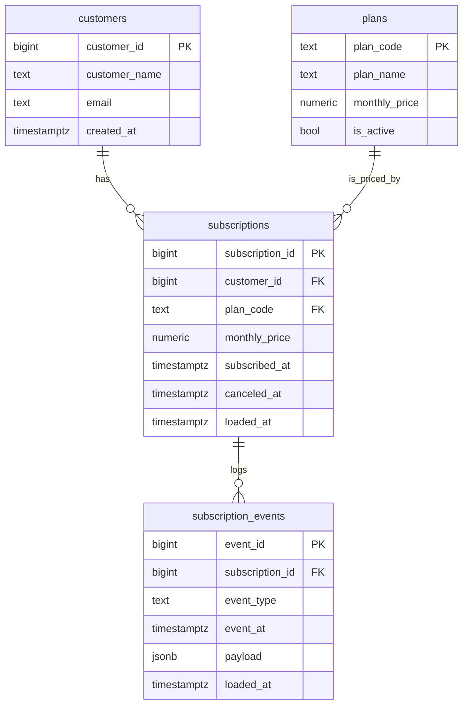

# 10-2 解答例

> subscriptions ドメインの ER 図を Mermaid `erDiagram` で完全記述する。
> 10-3 (sources.yml) で書く列名・型は本 ER 図から **そのまま** 引き写せるよう、
> Postgres 型で揃える。

## docs/exercises/100-knock/topic-10-integration/learner/er-diagram.md

````markdown
# Subscriptions ドメイン ER 図 (10-2)

> 10-1 の要件定義で宣言した N:1 / 1:N の cardinality を Mermaid `erDiagram`
> で図示する。本図は 10-3 (sources.yml) / 10-4 (staging contract) の列定義の
> 一次ソースとして参照される。

## ER 図



## エンティティ説明

| エンティティ | 行数想定 | 役割 |
|---|---|---|
| `customers` | 1,000 | 既存 EC ドメインの顧客マスタ。本ドメインからは FK 参照のみ (テーブル自体は本ドメインで作らない) |
| `plans` | 5〜10 | サブスクのプラン マスタ (`basic` / `pro` / `enterprise` 等)。マスタなので将来 seed 化候補 |
| `subscriptions` | 約 1,200 | 顧客 × プランの **現行契約**。1 顧客 0..N (休眠 / 複数契約あり) |
| `subscription_events` | 約 5,000 | プラン変更 / 解約 / 再開ログ。1 subscription に N 件 |

## カーディナリティ解説

- `customers ||--o{ subscriptions`
  - 「1 顧客は **0..N** 個の subscription を持つ」
  - 0 を許す: 顧客がまだ契約していない (新規登録のみ)
  - N: 同一顧客が解約 → 再契約で複数行 (履歴として残す方針)

- `subscriptions ||--o{ subscription_events`
  - 「1 subscription は **0..N** 個のイベントを持つ」
  - 0 を許す: 契約直後で何もイベントが発生していない
  - N: プラン変更 / 一時停止 / 解約 / 再開のイベント時系列

- `plans ||--o{ subscriptions`
  - 「1 plan に対し **0..N** 個の subscription が紐づく」
  - 0 を許す: 廃止プランで誰も契約していない
  - N: 同一プランを複数顧客が契約 (通常パターン)

## FK の方向性 (重要)

- `subscriptions.customer_id → customers.customer_id` のみ FK を張る (逆方向は張らない)
- 「customer から subscription を引く」のは join であり、`relationships` テストは
  **subscriptions → customers** の方向のみ宣言する (10-3 / 10-4 で実装)
- 同様に `subscription_events.subscription_id → subscriptions.subscription_id` のみ

これは 10-1 の要件「FK は単方向で張る」設計判断の継承。

## 10-3 〜 10-4 への引き継ぎ

本 ER 図の Postgres 型 (`bigint` / `text` / `numeric` / `timestamptz` / `jsonb`) を、
10-3 の `sources.yml` / 10-4 の staging schema.yml の `data_type:` に
**そのまま** 引き写す。
````

## 解説まとめ

- **なぜ ER 図を Markdown に埋め込むのか**: 別ツール (draw.io / Lucidchart) で書くと、PR レビュー時に「画像が更新されていない」「リンク切れ」が頻発する。Mermaid なら **diff が見える** = レビュー可能 = `git blame` も効く。
- **`erDiagram` の文法は単純**: 関係を `EntityA ||--o{ EntityB : "label"` で書き、属性を `EntityA { type col PK }` で書くだけ。10 分覚えれば一生使える。
- **PK / FK ラベルを書く意義**: ER 図を眺めただけで「外部キー候補」が機械的に分かる = 10-3 の `relationships` テスト宣言が機械的に決まる。「subscriptions に customer_id があるからきっと FK」という曖昧さを排除。
- **「`customers` は新規に作らない」を ER 図で表現**: 本 ER 図には `customers` も含めるが、10-3 で sources.yml に追加するのは `subscriptions` / `subscription_events` の 2 つだけ (+ 任意で `plans`)。「**接続先のエンティティ** は新規 source ではない」 という設計判断が ER 図で目視できる。
- **cardinality を 0..N で書く理由**: dbt の `relationships` テストはデフォルトで 0 を許す。「**1..N** 必須」を厳しく言いたい場合は `||--|{` を使うが、本ドメインでは「契約していない顧客」「イベントが発生していない subscription」も実体として存在するため、0 許容の `||--o{` が正解。
- **`plans` を入れるか入れないか**: 10-1 で KPI を 3 つに絞った時点で plans の独立 mart は不要だが、`subscriptions.plan_code` の値域 (= 5〜10 個の enum) を担保するために plans マスタを **seed として持つ** 設計が後々効く。本問では ER 図に登場させ、10-3 でも source として宣言する (任意拡張)。
- **`loaded_at` 列を ER 図に書く意義**: 10-3 で `freshness:` を宣言する際、`loaded_at_field:` のターゲットが必要。ER 図段階で `loaded_at timestamptz` を書いておくと、10-3 が「ER 図を見てそのまま書ける」状態になる。
- **N:N が無いことの意味**: subscriptions ドメインに N:N は (本設計では) 出てこない。N:N が必要になったら `subscription_addons` のような中間エンティティを作るのが本流。「**N:N を見たら関係テーブルを疑え**」が ER 図の鉄則。
- **次の 10-3 への接続**: 本 ER 図の `subscriptions` / `subscription_events` の **列名と型** が、そのまま `sources.yml` の `tables: - name: subscriptions / columns:` に書き写される。ER 図を 1 度書く労力で 10-3 / 10-4 のドラフトが半分書けている、という設計トレーサビリティが生まれる。
